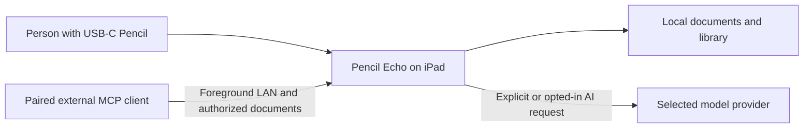

# Context Diagram

Status: PLANNED conceptual view; exact schemas/implementation pending.

```mermaid
flowchart LR
    Owner[Person with USB-C Pencil] --> App[Pencil Echo on iPad]
    App --> Local[Local documents and library]
    App -->|Explicit or opted-in AI request| Provider[Selected model provider]
    Client[Paired external MCP client] -->|Foreground LAN and authorized documents| App
```
